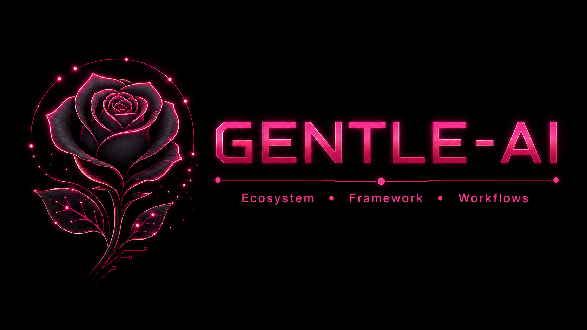
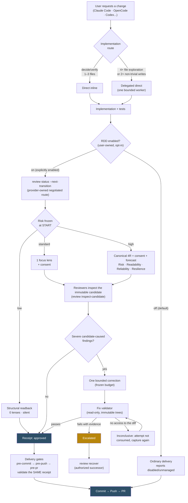
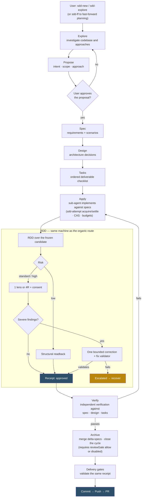

<div align="center">



<h1>Shevanio AI</h1>

<p><strong>Shevanio AI — Ecosystem, Frameworks, Workflows for AI coding agents.</strong></p>

<p>
<a href="https://github.com/Shevanio/shevanio-ai/releases"></a>
<a href="LICENSE"></a>


</p>

</div>

---

> [!IMPORTANT]
> **Shevanio AI has a signed stable release.** Install [v2.5.0](https://github.com/Shevanio/shevanio-ai/releases/tag/v2.5.0) with Homebrew or one of the verified alternatives below.
>
> Receipt-Driven Development (RDD) remains opt-in. Enable it with `shevanio-ai review mode enable --scope global` only after the local runtime is installed.

Shevanio AI is derived from [Gentle AI v2.4.0](https://github.com/Gentleman-Programming/gentle-ai/tree/v2.4.0). The original MIT license, copyright, contributors, and Git history remain part of this repository; see [NOTICE](NOTICE), [LICENSE](LICENSE), and [CONTRIBUTORS.md](CONTRIBUTORS.md).

## What It Does

Shevanio AI is NOT an AI agent installer. It adapts the agent runtime(s) already on your machine; it never installs one for you. If a selected agent isn't detected, Shevanio AI refuses and names the exact command you'd run yourself instead. It is an **ecosystem configurator** that equips the AI coding agent(s) you already use with persistent memory, Spec-Driven Development (SDD), curated skills, MCP servers, model routing, a teaching-oriented persona, and bounded native review.

**Before**: "I installed Claude Code / OpenCode / Cursor, but it's just a chatbot that writes code."

**After**: Your agent now has memory, skills, workflow, MCP tools, and a persona that actually teaches you.

### Supported Agent Integrations

| Agent | CLI ID | Delegation model | Key feature |
| --- | --- | --- | --- |
| **Claude Code** | `claude-code` | Full (Task tool) | Sub-agents and output styles |
| **OpenCode** | `opencode` | Full (multi-mode overlay) | Per-phase model routing |
| **Kilo Code** | `kilocode` | Full (multi-mode overlay) | OpenCode-compatible config in `~/.config/kilo` |
| **Gemini CLI** | `gemini-cli` | Full (experimental) | Custom agents in `~/.gemini/agents/` |
| **Cursor** | `cursor` | Full (native subagents) | SDD agents in `~/.cursor/agents/` |
| **VS Code Copilot** | `vscode-copilot` | Full (`runSubagent`) | Parallel execution |
| **Codex** | `codex` | Solo-agent | CLI-native TOML config |
| **Windsurf** | `windsurf` | Solo-agent | Plan Mode, Code Mode, and native workflows |
| **Antigravity** | `antigravity` | Solo-agent + Mission Control | Built-in browser/terminal sub-agents |
| **Kimi Code** | `kimi` | Full (native custom agents) | Modular prompt templates in `~/.kimi` |
| **Kiro IDE** | `kiro-ide` | Full (native subagents) | Native `~/.kiro/agents/` and steering orchestration |
| **Qwen Code** | `qwen-code` | Full (native sub-agents) | Slash commands and `~/.qwen/commands/` |
| **OpenClaw** | `openclaw` | Solo-agent | Workspace-first `AGENTS.md` / `SOUL.md` with global MCP config |
| **Trae** | `trae-ide` | Solo-agent | Desktop app with `~/.trae/skills/` and OS-specific rules |
| **Pi** | `pi` | Full (package-managed subagents) | `gentle-pi` harness with native persona, models, SDD, and memory |
| **Hermes** | `hermes` | Detect-only | YAML MCP config and `SOUL.md`; install manually first |

> **Pi is package-managed, not just configured.** Selecting Pi installs the first-class [`gentle-pi`](docs/pi.md) harness, which owns Pi-native persona and model controls, SDD assets, chains, and memory wiring.

> **Note**: This project supersedes [Agent Teams Lite](https://github.com/Gentleman-Programming/agent-teams-lite) (now archived). Everything ATL provided is included here with better installation, automatic updates, and persistent memory.

### Organic Routing and Review Boundaries

Every configured agent receives the same outcome-first routing, even when the optional SDD component is not selected. Ask for the outcome; the agent uses exactly one implementation route and reviews the candidate only after implementation.

| Situation | Expected behavior |
| --- | --- |
| Understanding needs 1-3 files, or one mechanical file change is already understood | Keep the bounded action direct and inline. |
| Understanding needs 4+ files, reading prepares a write, broad research is needed, or a writer changes 2+ non-trivial files | Delegate the narrow exploration or one focused writer without creating SDD state. |
| Durable proposal, spec, design, and task artifacts would materially reduce substantial ambiguity | Offer optional SDD; select it only after an explicit request or an accepted proposal. |
| A candidate is ready for review | Freeze the exact bytes and derive review effort from evidence, never size alone. Interactive starts ask once per clone before reviewer work; non-interactive tier-1/tier-2 starts proceed without prompting and report how to disable review mode. |
| Commit, push, PR, or release | Validate the same content-bound receipt at the applicable delivery gate; never silently reopen review or create another budget. |
| Scope changes or an operation is interrupted | Use provider-owned status, recovery, and reconciliation; do not infer authority or replay safety from narration. |

Implementation routing does not decide review strength, and per-action test, build, install, or review workers do not change the selected route. Native commands own repository identity, candidate scope, lifecycle transitions, receipts, and safe continuations. See [Organic Implementation Routing](docs/trigger-rules.md), the [Organic RDD architecture](docs/architecture/organic-rdd.md), and the [review authority threat model](docs/review-authority-threat-model.md).

---

## Quick Start

### Install with Homebrew (recommended)

Homebrew provides the shortest supported path on macOS and Linux, for both amd64 and arm64:

```bash
brew install shevanio/tap/shevanio-ai
shevanio-ai version
```

If Homebrew refuses the external tap, trust only this formula and retry the install:

```bash
brew trust --formula shevanio/tap/shevanio-ai
```

### Prerequisites

| Requirement | When you need it |
| --- | --- |
| An existing [supported agent runtime](#supported-agent-integrations) | Always. Shevanio AI configures agents; it does not install them. |
| Node.js 18+ and npm | When installing the ecosystem into an agent runtime. |
| Git 2.38+ | For project-aware workflows. |
| Go 1.25.10+ | Only for Go/source installation or Windows. |
| Homebrew | Only for the recommended Homebrew route. |
| `curl`, Minisign, and SHA-256 tooling (`sha256sum` or `shasum`) | Only for manual official archive installation. |

### First run

Run `shevanio-ai` to open the guided TUI. It detects supported agents and lets you review the selected components before installation.

For an explicit, auditable CLI path, inspect a dry run before applying the same selection:

```bash
shevanio-ai install --dry-run --agent opencode --preset full-shevanio
shevanio-ai install --agent opencode --preset full-shevanio
shevanio-ai doctor
```

The dry run returns before any writes. Replace `opencode` with the ID of an agent runtime already installed on your machine. Global scope is the default; add `--scope=workspace` to both install commands to keep agent-scoped files in the current project. Integrations that are global-only remain global by design.

### Upgrade and sync

Use the upgrade path that matches how you installed the binary. Every path ends by syncing managed assets and checking the installation.

**Homebrew:**

```bash
brew upgrade shevanio-ai
shevanio-ai sync
shevanio-ai doctor
```

**Official signed binary:**

```bash
shevanio-ai update
shevanio-ai upgrade
shevanio-ai sync
shevanio-ai doctor
```

**Go:**

```bash
go install github.com/shevanio/shevanio-ai/v2/cmd/shevanio-ai@latest
shevanio-ai sync
shevanio-ai doctor
```

Binary replacement and managed assets are version-bound: upgrading without `sync` can leave agent configuration on the previous version. See the [sync and upgrade reference](docs/usage.md#sync).

### Other installation methods

<details>
<summary><strong>Install with Go or build from source</strong></summary>

Install the latest version, or pin the current stable release for a reproducible installation:

```bash
go install github.com/shevanio/shevanio-ai/v2/cmd/shevanio-ai@latest
# Reproducible stable install:
go install github.com/shevanio/shevanio-ai/v2/cmd/shevanio-ai@v2.5.0
shevanio-ai version
```

To build the same stable version from source:

```bash
git clone --branch v2.5.0 --depth 1 https://github.com/Shevanio/shevanio-ai.git
cd shevanio-ai
go build -trimpath -o ./bin/shevanio-ai ./cmd/shevanio-ai
mkdir -p "$HOME/.local/bin"
install -m 0755 ./bin/shevanio-ai "$HOME/.local/bin/shevanio-ai"
"$HOME/.local/bin/shevanio-ai" version
```

Ensure the selected binary directory (`$(go env GOPATH)/bin` or `$HOME/.local/bin`) is on `PATH`. A local/source build does not embed the production Minisign trust anchors, so its binary self-upgrader fails closed instead of replacing itself. Update these installations with `go install` into the same binary directory, then run `shevanio-ai sync` and `shevanio-ai doctor`.

</details>

<details>
<summary><strong>Install an official signed archive on macOS or Linux</strong></summary>

Official archives cover `darwin` and `linux` on `amd64` and `arm64`. Select your platform, then download the archive and signed manifest from one immutable release:

```bash
version=2.5.0
os=linux       # linux or darwin
arch=amd64     # amd64 or arm64
archive="shevanio-ai_${version}_${os}_${arch}.tar.gz"
release_url="https://github.com/Shevanio/shevanio-ai/releases/download/v${version}"

curl --fail --location --remote-name "$release_url/$archive"
curl --fail --location --remote-name "$release_url/checksums.txt"
curl --fail --location --remote-name "$release_url/checksums.txt.minisig"
```

Obtain the public-key payload and verify its fingerprint through the maintained [release trust anchor](docs/release-trust-anchor.md), independently of the release assets. Do not copy the key only from the release being verified.

```bash
SHEVANIO_AI_MINISIGN_PUBLIC_KEY='<public-key-from-the-out-of-band-trust-anchor>'

trusted_comment="$(minisign -VQm checksums.txt \
  -x checksums.txt.minisig \
  -P "$SHEVANIO_AI_MINISIGN_PUBLIC_KEY")"
test "$trusted_comment" = "repo=Shevanio/shevanio-ai;tag=v${version}"

awk -v name="$archive" '$2 == name' checksums.txt | sha256sum --check --strict
tar -xzf "$archive" shevanio-ai
mkdir -p "$HOME/.local/bin"
install -m 0755 shevanio-ai "$HOME/.local/bin/shevanio-ai"
"$HOME/.local/bin/shevanio-ai" version
```

On macOS, use `awk -v name="$archive" '$2 == name' checksums.txt | shasum -a 256 --check` if `sha256sum` is unavailable. Ensure `$HOME/.local/bin` is on `PATH` before the first run.

</details>

<details>
<summary><strong>Install on Windows</strong></summary>

Windows 10/11 on amd64 or arm64 uses the Go installation path only:

```powershell
go install github.com/shevanio/shevanio-ai/v2/cmd/shevanio-ai@v2.5.0
shevanio-ai version
```

Ensure `%USERPROFILE%\go\bin` is on `PATH`. Official Windows archives and Scoop publication remain unavailable until trusted Authenticode signing is in place; no unsigned executable or remote installer is offered.

</details>

### Configure project context

Once your agents are configured, open your AI agent in a project and run these two commands to register the project context:

| Command                            | What it does                                                                | When to re-run                                                                 |
| ---------------------------------- | --------------------------------------------------------------------------- | ------------------------------------------------------------------------------ |
| `/sdd-init`                        | Detects stack, testing capabilities, activates Strict TDD Mode if available | When your project adds/removes test frameworks, or first time in a new project |
| `shevanio-ai skill-registry refresh` | Scans installed skills and project conventions, builds the registry         | After installing/removing skills, or first time in a new project               |

These are **not required** for basic usage. The SDD orchestrator runs `/sdd-init` automatically if it detects no context. Startup hooks normally keep the skill registry fresh for agents that support hooks, including Codex, Claude Code, OpenCode, and Pi through `gentle-pi`. If you start Pi with `pi -ns`, startup skill loading/hooks are skipped, so run the registry refresh manually when you need updated project rules.

Run `shevanio-ai doctor` at any time for a read-only health check of your ecosystem (tool binaries, `state.json`, Engram reachability, disk space).

### Command reference

README is the current command contract. The binary's `help` output remains the
source for exact syntax and compatibility behavior; this table keeps the
workflow discoverable without reproducing every protocol schema.

| Command | Purpose |
| --- | --- |
| `install` | Configure selected agents, components, skills, persona, and preset. |
| `uninstall` | Remove only Shevanio AI-managed configuration, with confirmation and backup. |
| `sync` | Refresh managed assets for the stored or explicitly selected agents. |
| `skill-registry refresh`, `skill-registry list` | Refresh or inspect the project skill index. |
| `sdd-status`, `sdd-continue`, `sdd-attempt`, `sdd-verify-validate` | Inspect, route, execute, recover, or validate native SDD orchestration. |
| `codegraph` | Inspect or reconcile the optional CodeGraph integration. |
| `review start`, `review capture-result`, `review inspect-candidate`, `review finalize` | Run the native bounded review lifecycle. |
| `review validate`, `review status`, `review repair`, `review mode` | Validate authority, inspect state, preflight repair, or control opt-in RDD. |
| `review-start`, `review-step`, `review-resume`, `review-bundle-export`, `review-bundle-import`, `review-validate` | Read-only or compatibility transport paths for shipped review authority. |
| `update`, `upgrade`, `restore`, `doctor`, `version` | Check/apply updates, restore backups, diagnose health, or print the version. |

Install flags are `--agent` / `--agents`, `--component` / `--components`,
`--skill` / `--skills`, `--persona`, `--preset`, `--sdd-mode`, `--scope`,
`--channel`, `--opencode-background-subagents`,
`--pi-background-subagents`, `--dry-run`, and `--help` / `-h`.
Sync adds `--sdd-profile-strategy`, `--strict-tdd`, `--include-permissions`,
`--include-theme`, `--profile`, and `--profile-phase`; it also supports the
agent/skill, background-subagent, dry-run, and help flags above. See the
[CLI usage reference](docs/usage.md) for examples and environment variables.

<details>
<summary><strong>RDD version policy</strong></summary>

RDD began upstream in Gentle AI `v1.47.0`, became its supported stable path in `v2.2.0`, and is inherited from the `v2.4.0` source baseline. These are upstream historical milestones, not Shevanio AI release claims.

</details>

---

## Core Workflow

1. **Install and configure.** Run the installer, select the agents and components you want, then open your agent in a project.
2. **Use the smallest implementation route.** Keep bounded work direct, delegate actions that need fresh context, and use SDD only after an explicit request or an accepted proposal. SDD artifacts can live in **Engram** for cross-session memory, **OpenSpec** for versioned files, or **hybrid** for both.
3. **Build with discipline.** `/sdd-init` detects project testing capabilities; when Strict TDD is active, SDD apply works test-first. SDD verify audits RED/GREEN evidence and runs verification. Agents that support delegation use focused subagents instead of one growing conversation.
4. **Review one candidate.** After implementation, bounded native review freezes the candidate and issues one content-bound receipt. Commit, push, and PR validate that same receipt. Releases validate native authority and its receipt, unless the protected-main fast path has the exact tag/current `origin/main` SHA, exact-SHA successful CI, a remote-head recheck, and no fresh risk.

> **Trust what the system can derive, not agent narration.** [Chapter 21 — Verifiable Trust](https://the-amazing-gentleman-programming-book.vercel.app/en/book/Chapter21_Verifiable-Trust) explains the mental model: agents assess the candidate; native authority and delivery gates independently derive what may be trusted.

5. **Upgrade, then sync.** Refresh the binary and the managed agent assets together:

   ```bash
   shevanio-ai upgrade
   shevanio-ai sync
   ```

### The flow at a glance

Once you enable it, both implementation routes converge on RDD: a bounded native review freezes the candidate and issues the one receipt that every delivery gate validates — review is never reopened for unchanged content. RDD is opt-in, so with it off both routes deliver under ordinary repository policy instead.

**Organic route (no SDD)** — the agent picks the smallest useful route and RDD enters at the end, over the frozen candidate:



**SDD route** — durable planning artifacts first, then apply, with RDD reviewing the candidate before verify and archive requiring the receipt:



Size, file count, or perceived risk never select SDD on their own — only an explicit request or an accepted proposal does. Either way, one candidate gets one review, one possible correction, and one receipt.

### Control receipt-driven development

Review mode is user-owned and available independently of the review lifecycle. **Receipt-driven development is opt-in: it is off until you turn it on.**

```bash
shevanio-ai review mode status --cwd .
shevanio-ai review mode enable --scope global --cwd .
shevanio-ai review mode disable --cwd .
```

`status` is read-only. With no source expressing an opinion the effective mode is `off`, reported as decided by `default`; only an explicit global enable turns review on. Any global or clone-local disabled source wins; a clone can opt out with `--scope clone` but cannot force review on, so `--scope global` is the only way in. Enabling applies only to future candidates, while declining a one-candidate review prompt does not change the mode. When review is off, existing exact governing receipts remain authoritative; otherwise native review gates report `disabled/unmanaged` and defer delivery to ordinary repository policy without fabricating approval.

Historical note: `v2.2.2` introduced the native delivery-gate `disabled/unmanaged` disposition. Current SDD status does not use that disposition: with review disabled, it skips review authority, emits no `reviewGate`, and pre-verify continues without routing to a review that cannot start. Archive proceeds under ordinary repository policy when `reviewGate` is absent; a present `reviewGate.result: allow` is required only for discovered review activity. This differs from native delivery gates, which report `disabled/unmanaged` when review is disabled.

### Release verification

[v2.5.0](https://github.com/Shevanio/shevanio-ai/releases/tag/v2.5.0) is the current signed stable release. Its authenticated checksum manifest binds the exact `Shevanio/shevanio-ai` repository and tag before the selected archive checksum is trusted. Signed production binaries enforce the same checks before replacement; local/source builds without production trust anchors fail closed.

For the complete manual download and verification sequence, use the [official signed archive instructions](#other-installation-methods). See [Release signing and key rotation](docs/release-signing.md) for the trust model, updater limits, and key-rotation runbook.

Windows archives and Scoop publication remain omitted until publicly trusted RSA Authenticode signing is provisioned (prefer managed OIDC with Azure Artifact Signing), both amd64 and arm64 executables are signed before archive and checksum generation, and release verification fails if either executable is unsigned.

### Review a focused staged candidate

For a monorepo or shared worktree, explicitly review exactly what is in the Git index:

```bash
git add apps/my-service
git diff --cached
shevanio-ai review start --projection staged
```

The staged projection freezes the **complete existing index**, including all previously staged paths. It starts review but does not itself issue an approved receipt; unstaged and untracked worktree content is excluded. The default `workspace` projection remains the complete workspace review, and an existing authority is never auto-converted between projections. See the [review authority threat model](docs/review-authority-threat-model.md) for delivery and base-ref details.

### Backups

Every install, sync, and upgrade automatically snapshots your config files. Backups are **compressed** (tar.gz), **deduplicated** (identical configs are not re-backed up), and **auto-pruned** (keeps the 5 most recent). Pin important backups via the TUI (`p` key) to protect them from pruning.

See [Backup & Rollback Guide](docs/rollback.md) for details.

---

## Current product map

The installer, sync path, and TUI use the same catalog. Select a preset for a
known baseline or choose components and skills explicitly. The complete
component and preset reference is [Components, Skills & Presets](docs/components.md).

### Components

| Component | ID | Current responsibility |
| --- | --- | --- |
| Engram | `engram` | Persistent cross-session memory and MCP wiring. |
| SDD | `sdd` | Spec-Driven Development prompts, lifecycle, and native orchestration. |
| Skills | `skills` | Curated workflow and coding skill files. |
| Context7 | `context7` | MCP access to current framework and library documentation. |
| Persona | `persona` | Managed Shevanio, neutral, or unmanaged custom behavior. |
| Permissions | `permissions` | Security-first defaults and sensitive-path guardrails. |
| OpenCode Theme | `theme` | OpenCode visual theme overlay. |
| Claude Code Theme | `claude-theme` | Claude Code visual theme overlay. |
| OpenCode Logo | `opencode-gentle-logo` | Managed OpenCode home-logo plugin. |

### Presets

| Preset | ID | Includes |
| --- | --- | --- |
| Memory Only | `minimal` | Engram plus SDD skills. |
| Dev Stack | `ecosystem-only` | Engram, SDD, Skills, and Context7 plus the full bundled skill set. |
| Dev Stack + Polish | `full-shevanio` | Dev Stack plus Persona, Permissions, and visual polish. |
| Custom | `custom` | Explicit component and skill selection; existing persona/settings remain unmanaged. |

`full-gentleman` remains an exact, case-sensitive read alias for existing installations. New commands and managed writes use `full-shevanio`.

### Bundled skills

SDD: `sdd-init`, `sdd-apply`, `sdd-verify`, `sdd-explore`, `sdd-propose`,
`sdd-spec`, `sdd-design`, `sdd-tasks`, `sdd-archive`, `sdd-onboard`.

Foundation and workflow: `go-testing`, `shevanio-ai-bench`, `skill-creator`,
`skill-improver`, `judgment-day`, `branch-pr`, `issue-creation`,
`skill-registry`, `chained-pr`, `cognitive-doc-design`, `comment-writer`,
`work-unit-commits`, `rdd-defect-workflow`, and `systemic-issue-triage`.

### Capability boundaries

- **Engram** stores durable decisions and context outside this repository. See
  [Engram Commands](docs/engram.md) for the external memory CLI and MCP boundary.
- **Context7** supplies current library and framework documentation through MCP;
  it does not replace source-based verification.
- **CodeGraph** is an optional community tool for indexed code intelligence and
  agent guidance. Shevanio AI installs or reconciles its integration but does
  not own the external runtime; see [Integrations](docs/codebase/integrations.md).
- **SDD** is explicit planning: explore, propose, spec, design, tasks, apply,
  verify, and archive. It may persist artifacts in Engram, OpenSpec, or both.
  `/sdd-init` detects project context and testing capabilities; [Intended Usage](docs/intended-usage.md)
  explains when to choose it.
- **Model profiles and permissions** are native controls. OpenCode profiles map
  models to phases, while permissions constrain sensitive paths. Project
  instructions and skills remain project-owned and are refreshed through the
  configured agent adapter.
- **Judgment Day** is the bundled adversarial two-judge workflow. **RDD** is a
  separate, user-owned receipt-driven review path and is off until explicitly
  enabled. Review authority freezes one candidate, records one receipt, and
  delivery gates validate that same content; see the [review authority threat model](docs/review-authority-threat-model.md).

### State, scope, and lifecycle

Shevanio AI records selected agents, components, skills, persona, model
assignments, and pending sync state in `~/.shevanio-ai/state.json`. Install
defaults to global agent configuration; `--scope=workspace` places agent-scoped
files in the current project where the adapter supports it. Engram project data
and external runtime state are separate ownership boundaries.

Install, sync, uninstall, and upgrade snapshot managed files before mutation.
Sync is idempotent and uses the stored agent selection unless `--agent` is
provided. Uninstall removes managed configuration only; it does not remove
external agent binaries, packages, repositories, hooks, or user-owned files.
Use `restore` or the TUI backup screen to recover a snapshot. See [Usage](docs/usage.md)
and [Backup & Rollback](docs/rollback.md) for operational detail.

### TUI actions

Running `shevanio-ai` opens the guided Bubbletea flow. It supports agent and
component selection, preset and skill selection, persona selection, per-agent
model configuration, community-tool and OpenCode-plugin registration, install
progress, sync/upgrade, doctor, managed uninstall, backup listing, restore,
rename, pin, deletion, and review-store reset survey/reset. TUI actions use the same planner and backup
boundaries as the CLI; use CLI dry runs when an auditable non-interactive plan
is preferred.

## Key Features You Should Know About

### OpenCode SDD Profiles

Assign different AI models to different SDD phases -- a powerful model for design, a fast one for implementation, a cheap one for exploration. OpenCode uses **`gentle-orchestrator`** as the base SDD conductor, and generated named profiles still appear as `sdd-orchestrator-{name}` entries.

```bash
# Via CLI
shevanio-ai sync --profile cheap:openrouter/qwen/qwen3-30b-a3b:free
shevanio-ai sync --profile-phase cheap:sdd-design:anthropic/claude-sonnet-4-20250514

# Or via TUI: shevanio-ai → "OpenCode SDD Profiles" → Create
```

After creating a profile, open OpenCode and press **Tab** to switch between `gentle-orchestrator` (default) and your custom profiles.

| What you need         | Use this                                                        |
| --------------------- | --------------------------------------------------------------- |
| Default SDD conductor | `gentle-orchestrator`                                           |
| Legacy configs        | `sdd-orchestrator` is migrated to `gentle-orchestrator` on sync |
| Named model profiles  | `sdd-orchestrator-cheap`, `sdd-orchestrator-premium`, etc.      |

**Full guide**: [OpenCode SDD Profiles](docs/opencode-profiles.md)

### Engram (Persistent Memory)

Your AI agent automatically remembers decisions, bugs, and context across sessions. You don't need to do anything -- but when you do:

```bash
engram projects list          # See all projects with memory counts
engram projects consolidate   # Fix name drift ("my-app" vs "My-App")
engram search "auth bug"      # Find a past decision from the terminal
engram tui                    # Visual memory browser
```

**Full reference**: [Engram Commands](docs/engram.md)

---

## Documentation

| Your task | Start here |
| --- | --- |
| Understand the Shevanio AI mental model | [Intended Usage](docs/intended-usage.md) |
| Choose direct, delegated, or optional SDD routing | [Organic Implementation Routing](docs/trigger-rules.md) |
| Plan substantial work with SDD | [Intended Usage](docs/intended-usage.md) and [OpenSpec Config](docs/openspec-config.md) |
| Configure a supported agent | [Agents](docs/agents.md) for the feature matrix and per-agent notes |
| Use the Pi package harness | [Pi Agent](docs/pi.md) for packages, Pi-native commands, models, and troubleshooting |
| Configure OpenCode phase models | [OpenCode SDD Profiles](docs/opencode-profiles.md) |
| Review or deliver a change safely | [Review Integration Contract](docs/review-integration.md) for provider consumers; [Review Authority Threat Model](docs/review-authority-threat-model.md) for technical boundaries; [Chapter 21 — Verifiable Trust](https://the-amazing-gentleman-programming-book.vercel.app/en/book/Chapter21_Verifiable-Trust) for the mental model |
| Find or share persistent context | [Engram Commands](docs/engram.md) |
| Refresh or troubleshoot an installation | [Usage](docs/usage.md), [Backup & Rollback](docs/rollback.md), and [Platforms](docs/platforms.md) |
| Extend or contribute to Shevanio AI | [Codebase Guide](docs/CODEBASE-GUIDE.md), [Components, Skills & Presets](docs/components.md), [Skill Registry](docs/skill-registry.md), and [Architecture & Development](docs/architecture.md) |
| Understand how agent behavior is tested | [Testing Agents Deterministically](docs/testing-agents-deterministically.md) for the real-agent E2E and its model fixture |

---

## Community Highlights

This project gets better when the community builds on top of it.

### Community Integrations

- [sub-agent-statusline](https://github.com/Joaquinvesapa/sub-agent-statusline) — optional OpenCode TUI plugin that shows sub-agent activity, status, elapsed time, and token/context usage when OpenCode exposes it.
- [sdd-engram-plugin](https://github.com/j0k3r-dev-rgl/sdd-engram-plugin) — optional OpenCode TUI plugin to manage SDD profiles and browse Engram memories directly from OpenCode, with runtime profile activation and no restart required.

When you select OpenCode in the installer, Shevanio AI asks whether to register each community plugin and offers a browser shortcut to review the repository first. Shevanio AI only ensures `~/.config/opencode/tui.json` exists and adds the plugin package names to its `plugin` array; OpenCode installs/loads those packages the next time it starts. Once OpenCode has materialized a plugin under `~/.config/opencode/node_modules/`, `shevanio-ai update` can compare its local `package.json` version with the plugin's GitHub releases.

### Contributors

This project exists because of the community. See [CONTRIBUTORS.md](CONTRIBUTORS.md) for the full list.

<a href="https://github.com/Gentleman-Programming/gentle-ai/graphs/contributors">
  
</a>

---

## Next Steps

- **Just installed?** Read [Intended Usage](docs/intended-usage.md) for the mental model, then run `shevanio-ai doctor` if anything looks wrong.
- **Starting work?** Read [Organic Implementation Routing](docs/trigger-rules.md) to understand direct, delegated, and optional SDD behavior.
- **Reviewing a focused change?** Start with the [Organic RDD architecture](docs/architecture/organic-rdd.md) and [review authority threat model](docs/review-authority-threat-model.md).
- **Maintaining Shevanio AI?** Use the [Codebase Guide](docs/CODEBASE-GUIDE.md) to find package ownership and review boundaries.
- **Using Pi?** Read [Pi Agent](docs/pi.md) for the `gentle-pi` harness, Pi commands, persona, and model assignments.
- **Ready to contribute?** Start at the [Community Roadmap](docs/community-roadmap.md) — everything labelled [`up-for-grabs`](https://github.com/Shevanio/shevanio-ai/issues?q=is%3Aissue+is%3Aopen+label%3Aup-for-grabs) is scoped, approved and unclaimed. Then read [CONTRIBUTING.md](CONTRIBUTING.md).

---

<div align="center">
<a href="LICENSE"></a>
</div>
